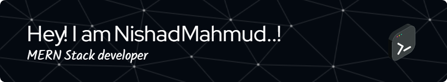

# 💫 About Me:
Hi, I'm Nishad Mahmud, a Computer Science student passionate about building intuitive, efficient, and user-friendly software. I love exploring the intersection of design and logic, whether it's through full-stack web development, Java-based desktop applications, or solving complex problems with clean code.  💻 What I Do 🌱 Currently learning and building with React, Node.js, and Firebase  ⚙️ Experienced in Java, JavaScript, Python, and C++  🔧 Enjoy developing visual tools, automation scripts, and educational software  🧠 Always curious about algorithms, software architecture, and UI/UX  🛠 Projects I'm Proud Of Logic Gates Simulator – A Java-based tool to design and simulate digital circuits  Plantopia – A full-stack e-commerce platform for gardening and plant care  Algorithm Visualizer – Interactive tool for visualizing data structures and algorithms   

## 🌐 Socials:
    

# 💻 Tech Stack:
                              
# 📊 GitHub Stats:
 
 

<!-- Proudly created with GPRM ( https://gprm.itsvg.in ) -->
